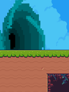
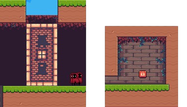
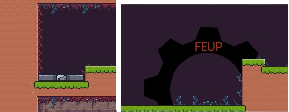
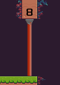
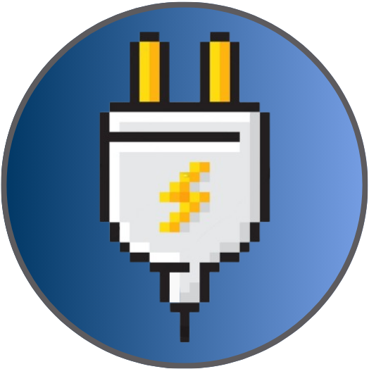

# Escape Engines

## About

Escape Engines is a platformer game developed as part of the preliminary project of the [Digital Games Design and Development course](https://itch.io/jam/ddjd-feup-2024-preliminary-projects).

Based on the Lemmings game, Escape Engines features the escape journey of small lemmings. To successfully escape, they must acquire the powers of engineering, toggling engines, or even shaping themselves to fit in the environment!

## Installation

If you wish to play the game without downloading any files, you can check the [game's itch.io page](https://carlosverissimo3001.itch.io/escape-engines). If not, please follow the steps below.

Installation is not required. Instead, follow the steps below:

- **1.** Locate the `DDJD-PP-G06-Escape Engines-game.zip` file and extract its contents.
- **2.** Depending on the operating system, follow one of the following steps
- **2.1 Windows**
  - Double-click on the `Escape Engines.exe` file to run the game.
- **2.2 Linux**
  - Open a terminal and execute `./escape_engines`

## How to play

### Goal

The hoodies will be spawned in a defined spot in the map. The goal is to lead them to the exit, using the available power-ups to clear their path.

### Map Features

| Image | Name | Description |
| --- | --- | --- |
|
 
| Exit | This is where you should lead the hoodied characters to.|
|  
| `Electric Platfrom`/`Button` | When fixed, the button will trigger the movement of the respective eletric platform. |
|
  
|`Gear`/`Activation Platform`| A gear will remain still until the activation platform is triggered.|
|
 
|Sensor|If the sensors detects the passage of N hoodies, it closes the area, denying any further passage.|

### Powerups

| Ability | Effect | Description |
| --- | --- | --- |
|  |  |Use the power of the electricity near a locked button to move the respective `Eletric Platform`. |
|  |  | Only those with this power-up standing on an `Activation Platform` can trigger the rotation of a `Gear`. |
|  |  | Reduce your size to fit in tight spots. |
|  |  | Get bigger to cross over gaps in the map. |

### Controls

Using only your mouse, select a power-up to apply it to a given lemming. Only 1 power-up can be assigned to a given lemming at a time!

Other controls include:

| Key | Action |
| --- | --- |
| `R` | Restart the level |
| `P` | Pause the game |

## Demo

## Credits/Resources

[Hooded Protagonist Sprites](https://penzilla.itch.io/hooded-protagonist) - the sprites for the main characters

[Wastelands Tileset](https://quintino-pixels.itch.io/wasteland-plataformer-tileset) - tileset for the cave side of the level

[Pixel Adventure Tileset](https://pixelfrog-assets.itch.io/pixel-adventure-1) - used for the floor and walls of the level

[Kings and Pigs Tileset](https://pixelfrog-assets.itch.io/kings-and-pigs) - used for the eletric platforms

[Sky with clouds](https://free-game-assets.itch.io/free-sky-with-clouds-background-pixel-art-set) - used for the sky

[Pixel Portal SpriteSheet](https://grappe.itch.io/pixelportal) - sprite sheet for both the spawn and exit animations

## Group Members

| Name | Contact | GitHub
| --- | --- | --- |
| Carlos Veríssimo | <up201907716@up.pt> | [carlosverissimo3001](https://github.com/carlosverissimo3001)
| Nuno Jesus | <up201905477@up.pt> | [Nuno-Jesus](https://github.com/Nuno-Jesus)
