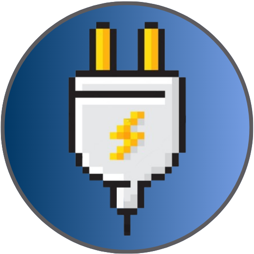

# Escape Engines - Documentation

## About

Escape Engines is a platformer game developed as part of the preliminary project of the [Digital Games Design and Development course](https://itch.io/jam/ddjd-feup-2024-preliminary-projects)

Escape Engines, based on the Lemmings game, features the escape journey of small lemmings. To successfully escape, they must acquire the powers of engineering, toggling engines, or even shaping themselves to fit in the environment!

## Installation

Installation is not required. Instead, follow the steps below:
- **1.** Locate the `DDJD-PP-G06-Escape Engines-game.zip` file and extract its contents.
- **2.** Depending on the operating system, follow one of the following steps
- **2.1 Windows**
- - Double click on the `Escape Engines.exe` file to run the game.
- **2.2 Linux**
- - Open a terminal and execute `./escape_engines`

## How to play

### Powerups

| Ability | Effect | Description |
| --- | --- | --- |
|  |  |Use the power of the electricity near a locked button to move a nearby platform. |
|  |  | Only those with this power-up standing on an activation platform can trigger the rotation of a gear |
|  |  | Reduce your size to fit in tight spots. |
|  |  | Get bigger to cross over gaps in the map. |

### Controls

Using only your mouse, select a power-up to apply it to a given lemming. Only 1 power-up can be assigned to a given lemming at a time!

Other controls include:

| Key | Action |
| --- | --- |
| `R` | Restart the level |
| `P` | Pause the game |

## Credits/Resources

## Group Members

| Name | Contact |
| --- | --- |
| Carlos Veríssimo | <up201907716@up.pt>
| Nuno Jesus | <up20190547@up.pt>
